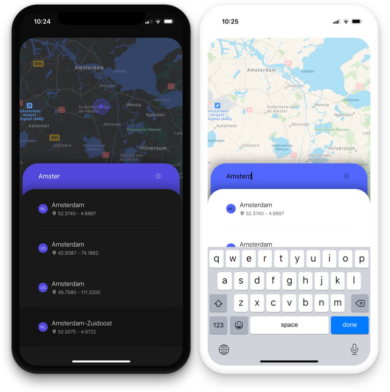
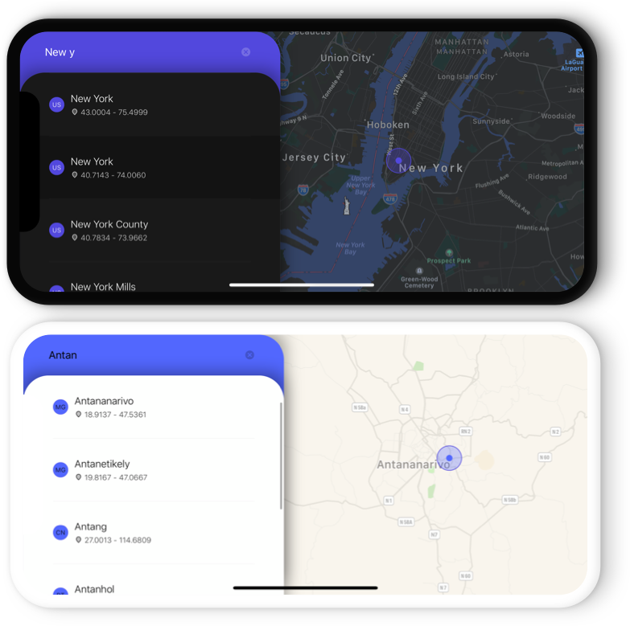

    
    

# Cities App (assignment 2020)
A little cities app that shows a city's location on a map.

## Features
- Load, parse and sort a large array of `City` objects.
- Filter data quickly with binary search algorithm.
- Unit tests for the binary search algorithm.
- Displays cities in a scrollable list, in alphabetical order (city first, country after).
- Shows location on the map when tapped.

## Supports
- iOS 12 and iOS 13
- Light- and dark-mode.
- Portrait and landscape interface orientation.

## Tested on
- iPhone 6, iOS 12
- iPhone X, iOS 13
- iPhone 11 Pro Max, iOS 13

## Suggestions or feedback?

Feel free to create a pull request, open an issue or find [me on Twitter](https://twitter.com/roberthein).